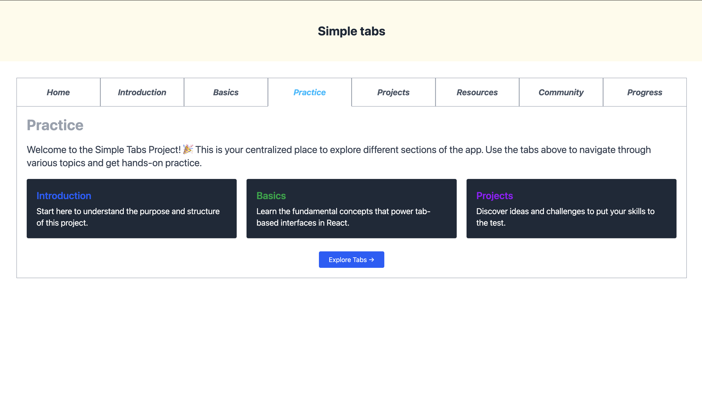

# Simple Tabs 🗂️

A clean and responsive React component that allows users to switch between multiple tabs and view content dynamically based on the active tab.

---

## ✨ Features

- **Tabbed Navigation**: Easily switch between 8 predefined tabs.
- **Dynamic Content Rendering**: Each tab displays its own unique content.
- **Active Tab Highlighting**: Visually indicates which tab is currently active.
- **Component-Based Structure**: Clean separation of concerns using React components.

---

## 🧪 How It Works

The interface consists of:
- A **tab header row** with clickable tab buttons.
- A **content area** that changes based on the active tab.

When a tab is clicked:
1. The `currentTab` state is updated.
2. The corresponding component from `tabContentMap` is rendered.
3. The clicked tab is visually highlighted to indicate it’s active.

---

## 🖼 Demo

