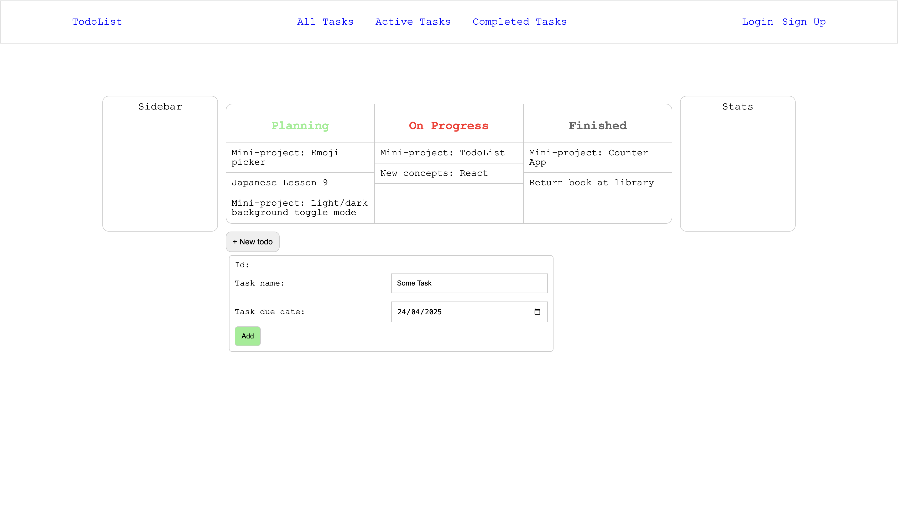
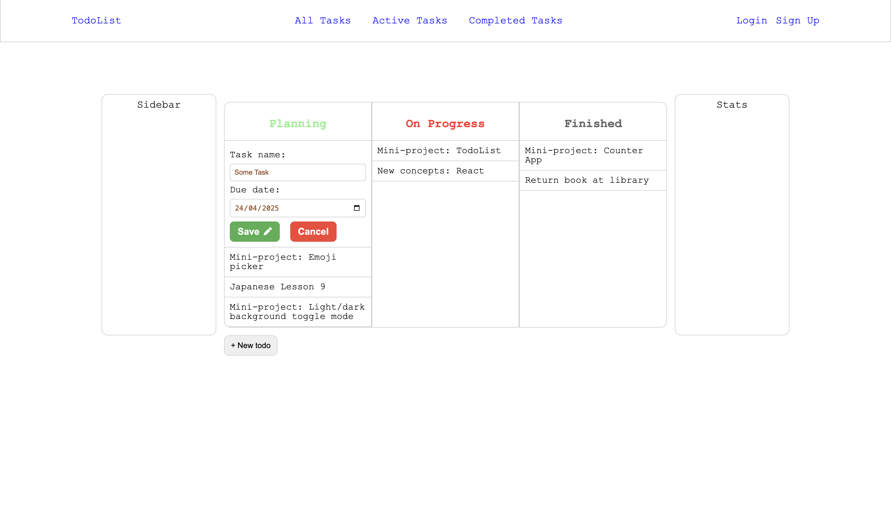
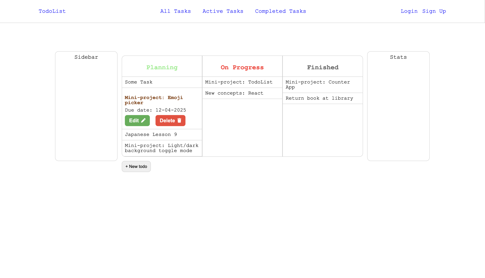

# 📝 To-Do List App

A simple and interactive To-Do List web application built with **React**. This project is part of the `how_to_react` practice series and is designed to help reinforce React fundamentals such as state management, list rendering, controlled inputs, and persistent data storage.

---

## 🚀 Features

### ✅ Basic Operations

- **Add Task**: Input a task name and add it to the list.
- **Mark as Completed**: Click to toggle the completed status (visual feedback with strike-through).
- **Delete Task**: Remove a task from the list.

### 🧹 Clear Completed Tasks

- One-click button to delete all tasks marked as completed.

### 📊 Task Count (Future Improvement)

- Displays the number of tasks remaining (active tasks left).

### ✏️ Edit Task

- Double-click a task to **edit** its content.
- Press `Enter` or click outside to save changes.

### 📅 Due Dates

- Optionally set a **due date** for each task.
- Can be displayed alongside the task name.

### 💾 Persistent Storage (Future Improvement)

- Tasks are stored in `localStorage` so they **persist between sessions**.

---

## 🎯 Purpose & Learning Goals

- Practice `useState` for dynamic state management
- Work with controlled inputs and form handling
- Apply conditional rendering and list filtering
- Learn how to work with localStorage for data persistence
- Improve UI/UX design with interactive elements

---

## 🛠️ Tech Stack

- React (Vite or CRA)
- Plain CSS (for styling)
- No backend or database

---

## 📸 Demo

---

Feel free to fork and customize this project. Happy coding!
